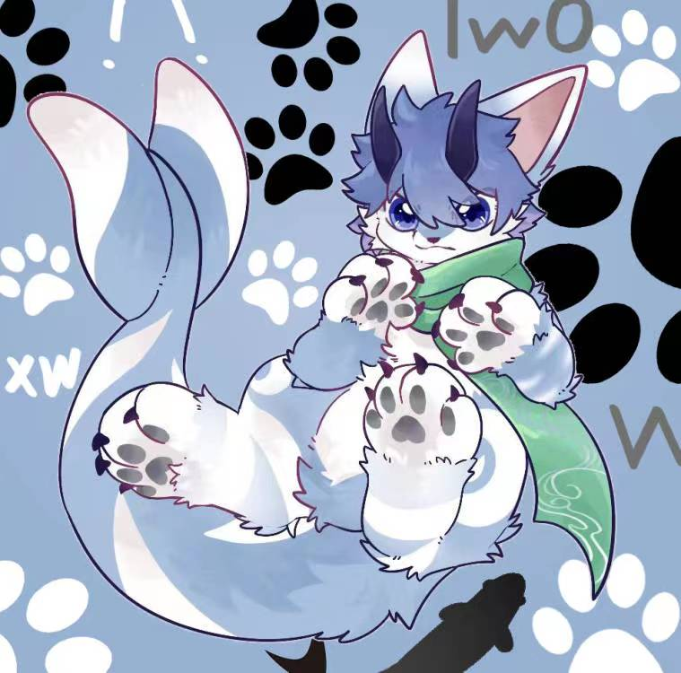

## Hi there! 👋

Hi, everyone! This is LazyPool, a cute, furry dragon from sea, a little chatty and anthomaniac.

I came to land because I hated seafood and I wasn't good at swimming.

I have been trying to learn the manners of the land so long, and most like to play with the small animals.

### Skills! 🌱

Have a similar understanding of most programming languages: C/C++, Python, Golang, Java, Nodejs.

Sometimes can solve really complicated math problems, but only sometimes.

Can occasionally propose some strange and interesting ideas. Imagination precedes action.

### Hobbies! 🔭

`Animal!`. Like almost all mammals except primates. Would must stop to have a looks when encounter a puppy or kitty.

`Computer!`. At the age of 20, I switched to ArchLinux and created my own windows manager, text editor, and all sorts of other messy stuff.

`AI!`. I like deep learning and neural networks, especially in the field of NLP. I've read a lot of articles and run my own projects.

`Martial!`. I can't resist costume dramas and martial arts movies. Sometimes I imagine myself doing chivalrous deeds, wandering around the world.

`Chess!`. Chinese chess is almost the game I play the most, in wich I have a certain crazy confidence.

### Contact Me! 📫

- QQ: 3416382833
- Email: lazypool@proton.me
